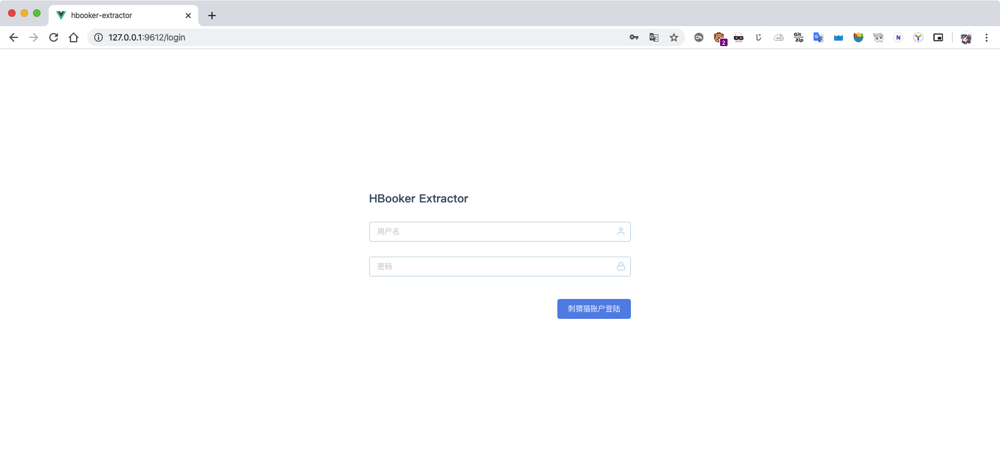
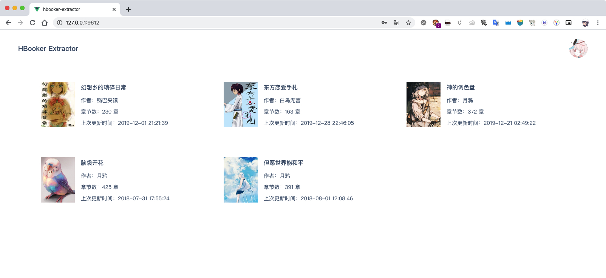
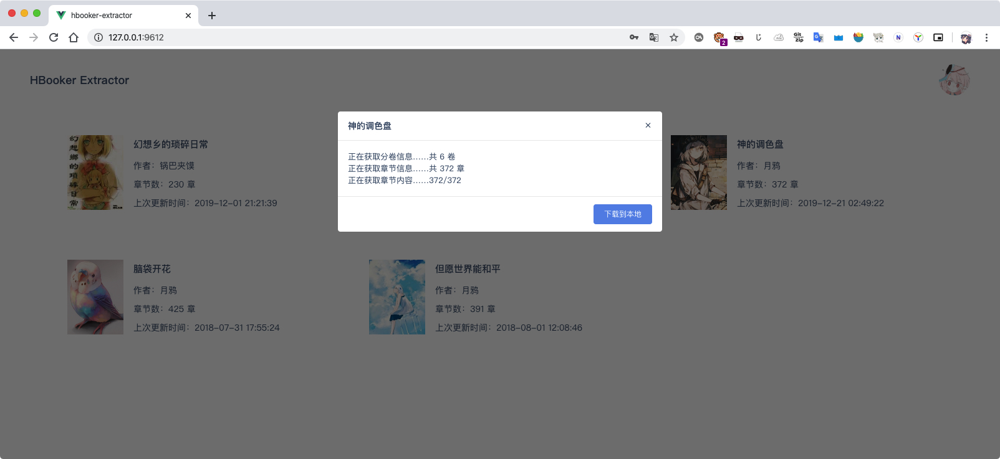

# hbooker-extractor

使用 vue 和 at-ui 编写的 刺猬猫 小说提取工具。

## 程序部署

```
//拉取依赖
yarn install
//开发调试
yarn serve
//编译
yarn build&&cd server&&yarn
//运行编译结果
cd server&&node app.js
```

## 其他说明

在开发环境下，程序使用 webpack 的 devServer 来反代刺猬猫的后端接口以解决跨域问题，而如果要打包，则已经在 server 目录中内置了一个由 koa 驱动的代理服务。webpack 会自动把打包结果输出到 server/static 目录下供之调用。

由于是一个较为简单的实现，所以目前只是以单线程进行下载，慢慢等待即可 :)

你的登录状态以及账户信息完全保存在你的本地，本程序不会保存和分发任何你的私有信息。

程序下载的内容仅包括免费书籍以及您登陆的账户所订阅的章节，无任何破解相关的功能，望周知。

作者写书不易，请自觉保护版权！请勿将本程序用于非法行为，作者不承担任何责任！

## 截图






